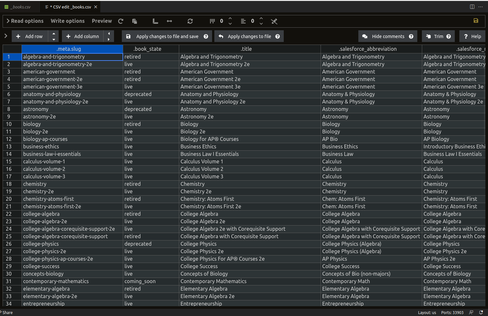

# How to edit

1. Open this repository in [gitpod.io](https://gitpod.io/from-referrer/)
1. Open a CSV file and click `Edit CSV` in the top-right (it uses [this VSCode extension](https://github.com/janisdd/vscode-edit-csv))
1. Save the file, commit it, and push the changes up

